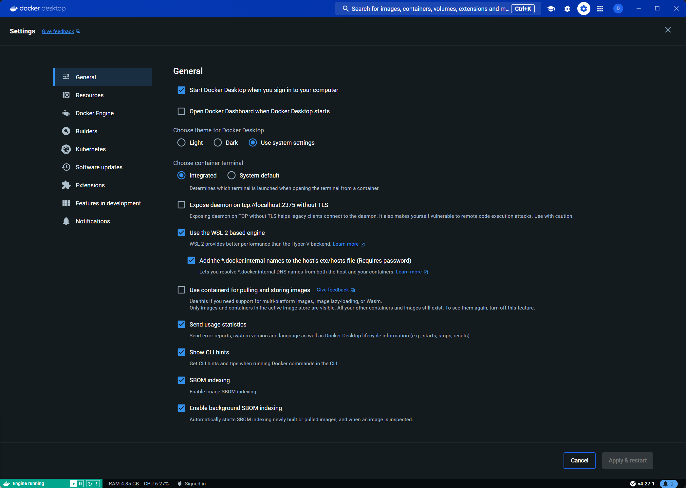

# OpenTelemetry together with the Grafana stack

This repository is a work in progress, about having an observability stack for your microservices environment with [.NET Aspire](https://github.com/dotnet/aspire).

If you want to know/learn more, also check out my Pluralsight course on the subject here [https://www.pluralsight.com/library/courses/opentelemetry-grafana-observability](https://www.pluralsight.com/library/courses/opentelemetry-grafana-observability)

### Components used:

- ASP.NET Web API for demo services
- RabbitMq as message queue
- OpenTelemetry Collector as middle man for tracing and logs
- BlackBox and Prometheus for service metrics and health checks
- Loki for log aggregation
- Tempo for tracing aggregation
- Grafana for overall dashboarding

### Remarks:

To be able to get the environment functioning correctly be sure to have following setting active in Docker Desktop: **Add the \*.docker.internal names to the host's etc/hosts file**



For alert provisioning we can extract the JSON through use of the Grafana API: [https://grafana.com/docs/grafana/latest/developers/http_api/alerting_provisioning/](https://grafana.com/docs/grafana/latest/developers/http_api/alerting_provisioning/)

This sample is sending logs from SeriLog to OpenTelemetry in OTLP format and OpenTelemetry will pass it along to Loki.

### Usage:

The project will start through dotnet Aspire with following command

```
dotnet run --project otel.AppHost
```
